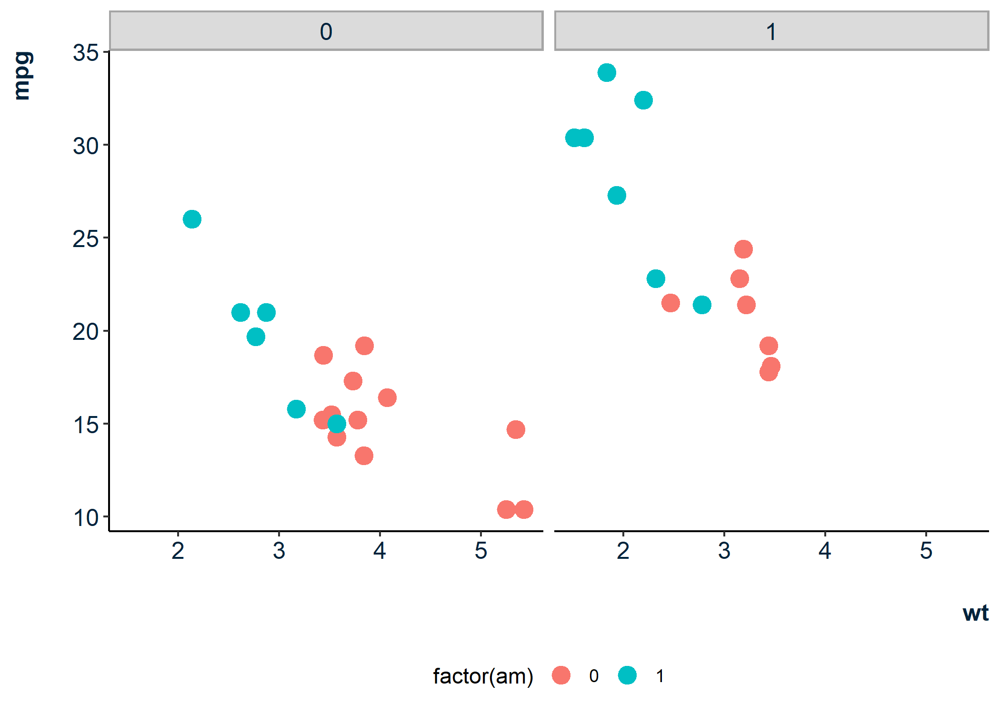

<!-- README.md is generated from README.Rmd. Please edit that file -->

# epinionDSB

<!-- badges: start -->

<!-- badges: end -->

The goal of `epinionDSB` is to provide easy-to-use templates for
visualizations using the `ggplot2` package

## Installation

You can install the development version from
[GitHub](https://github.com/) with:

``` r
# install.packages("devtools")
devtools::install_github("jvieroe/epinionDSB")
```

## Readymade `ggplot2` style

The `epinionDSB::dsb_style()` function adds a tailormade theme to your
`ggplot2` graphics. This allows for a coherent Corporate Visual Identity
(CVI) for Epinion consultants working with DSB. Importantly, the
`dsb_style()` function both

  - serves as a time-saver when producing many visualizations, as
    compared to specifying `ggplot2::theme()` in each plot
  - allows you to efficiently align visual styles and apply these across
    the board by altering the content of the `dsb_style()` function
    itself

### Example: `dsb_style()`

``` r
library(tidyverse)
library(epinionDSB)
```

``` r
ggplot(mtcars, aes(x = wt,
                   y = mpg,
                   color = factor(am))) +
  geom_point(size = 3) +
  facet_wrap(~ cyl) +
  dsb_style()
```



You’ll still need to render `README.Rmd` regularly, to keep `README.md`
up-to-date. `devtools::build_readme()` is handy for this. You could also
use GitHub Actions to re-render `README.Rmd` every time you push. An
example workflow can be found here:
<https://github.com/r-lib/actions/tree/master/examples>.

You can also embed plots, for example:


In that case, don’t forget to commit and push the resulting figure
files, so they display on GitHub and CRAN.
