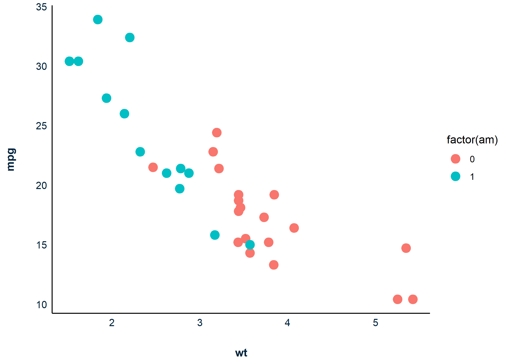
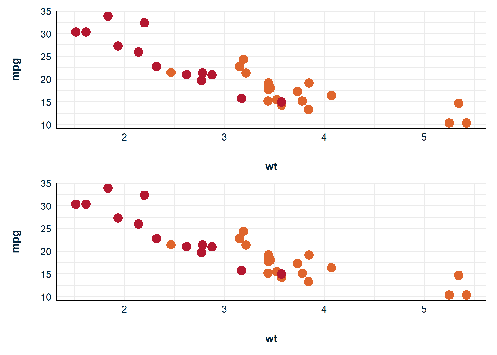

<!-- README.md is generated from README.Rmd. Please edit that file -->

# epinionDSB

<!-- badges: start -->

[](https://www.codefactor.io/repository/github/jvieroe/epiniondsb)
[]()
[](https://lifecycle.r-lib.org/articles/stages.html#experimental)
[-blue.svg)](https://cran.r-project.org/web/licenses/GPL%20\(%3E=%203\))
[](https://github.com/jvieroe/epinionDSB/commits/main)

Master branch status:
[](https://github.com/jvieroe/epinionDSB/actions)
<!-- badges: end -->

# Introduction

The goal of `epinionDSB` is to provide easy-to-use templates for
visualizations using the `ggplot2` package and in line with the
Corporate Visual Identity (CVI) of DSB.

## Installation

You can install the development version from
[GitHub](https://github.com/) with:

``` r
if(!require("devtools")) install.packages("devtools")
library(devtools)
devtools::install_github("jvieroe/epinionDSB")
```

## Readymade `ggplot2` style

The `epinionDSB::dsb_style()` function adds a tailormade theme to your
`ggplot2` graphics. This allows for a coherent Corporate Visual Identity
(CVI) for Epinion consultants working with DSB. Importantly, the
`dsb_style()` function both

  - serves as a time-saver when producing many visualizations, as
    compared to specifying `ggplot2::theme()` in each plot
  - allows you to efficiently align visual styles and apply these across
    the board by altering the content of the `dsb_style()` function
    itself

### Example

``` r
library(tidyverse)
library(epinionDSB)
```

The `dsb_style()` function does not impact the `aes()` of your
`geom_*()`, only the `ggplot2::theme()`. The only argument taken by
`dsb_style` (at the time of writing) is the `legend` option specifying
whether a legend is included and defaulting to `TRUE` (with
`legend.position` defaulting to `"right"`).

``` r
ggplot(mtcars, aes(x = wt,
                   y = mpg,
                   color = factor(am))) +
  geom_point(size = 4) +
  facet_wrap(~ vs) +
  dsb_theme_classic()
```


Note that all `ggplot2::theme()` settings inherent in `dsb_style()` can
be overwritten by adding `theme()` elements after `dsb_style()`:

``` r
ggplot(mtcars, aes(x = wt,
                   y = mpg,
                   color = factor(am))) +
  geom_point(size = 4) +
  facet_wrap(~ vs) +
  dsb_theme_classic() +
  theme(legend.position = "right")
```



<!-- You'll still need to render `README.Rmd` regularly, to keep `README.md` up-to-date. `devtools::build_readme()` is handy for this. You could also use GitHub Actions to re-render `README.Rmd` every time you push. An example workflow can be found here: <https://github.com/r-lib/actions/tree/master/examples>. -->

<!-- In that case, don't forget to commit and push the resulting figure files, so they display on GitHub and CRAN. -->

## Color palettes

Above, I get the standard colors in `ggplot2` because `aes(color =
factor(am))` was not followed by a color specification. We could
manually add colors as specified by *[the DSB Design
Manual](https://github.com/jvieroe/epinionDSB/blob/main/data/DSB_graf-farver.pdf)*
(DSBDM).

### Extract HEX codes using `dsb_colvec()`

The `epinionDSB` package provides access to the color palette in the
DSBDM and for readily used color palettes. Specifically, the
`dsb_colvec` function extracts HEX codes by the color names.

``` r
# ... all DSB colors
dsb_colvec()
#>        DSB Red   DSB DarkBlue  DSB LightBlue     DSB Orange  DSB LightGrey 
#>      "#B41730"      "#00233C"      "#5382B6"      "#DF652C"      "#A5A5A5" 
#>     DSB Purple       DSB Teal   DSB Turqoise   DSB DarkGrey DSB LightGreen 
#>      "#6E3C6E"      "#28767E"      "#41BDBF"      "#747474"      "#88C988" 
#>      DSB Green  DSB DarkGreen 
#>      "#1CA645"      "#144E36"

# a selection of colors
dsb_colvec("DSB Red", "DSB DarkBlue")
#>      DSB Red DSB DarkBlue 
#>    "#B41730"    "#00233C"
```

We can use these in our `ggplot2` syntax or by pasting the HEX codes or,
more elegantly, by using the `getElement()` function:

``` r
ggplot(mtcars, aes(x = wt,
                   y = mpg,
                   color = factor(am))) +
  geom_point(size = 4) +
  facet_wrap(~ vs) +
  dsb_theme_classic() +
  scale_colour_manual(values = c(getElement(dsb_colvec(), "DSB Red"), 
                                 getElement(dsb_colvec(), "DSB DarkBlue"))) +
  theme(legend.position = "none")
```


Great\! This is **much** more in line with DSB’s visual identity. This
is a tedious process, however, and any changes to the CVI would involve
a lot of manual changes in our accumulated `ggplot2` syntax.

### Apply ready-made color palettes

To provide a more verbose alternative, the `epinionDSB` contains
out-of-the-box syntax to provide our `ggplot2` figures with a color
palette consisting of the colors in the DSBDM:

  - `color_dsb_d`: to use with the `aes(color = x)`, where x is a
    `factor` or `character` variable
  - `color_dsb_c`: to use with the `aes(color = x)`, where x is a
    `numeric` or `integer` variable
  - `fill_dsb_d`: to use with the `aes(fill = x)`, where x is a `factor`
    or `character` variable
  - `fill_dsb_c`: to use with the `aes(fill = x)`, where x is a
    `numeric` or `integer` variable

Note that, similarly to `ggplot2::scale_color_*()`, `color_dsb_*` is
**not** sensitive to American/English spelling and `colour_dsb_*` works
identically.

**Let’s check it out\!**

``` r
library(gridExtra)

# discrete variable in aes()
p1 <-
  ggplot(mtcars, aes(x = wt,
                     y = mpg,
                     color = factor(am))) +
  geom_point(size = 4) +
  facet_wrap(~ vs) +
  dsb_theme_classic() +
  theme(legend.position = "right") +
  color_dsb_d()

# continuous variable in aes()
p2 <-
  ggplot(mtcars, aes(x = wt,
                     y = mpg,
                     color = disp)) +
  geom_point(size = 4) +
  facet_wrap(~ vs) +
  dsb_theme_classic() +
  theme(legend.position = "right") +
  color_dsb_c()

grid.arrange(
  p1, p2,
  ncol = 1
  )
```


`color_dsb_*()` and `fill_dsb_*()` primarily take two arguments as
inputs:

  - `palette`, which allows you to choose your color palette. Call
    `epinionDSB::dsb_palettes` for a complete overview
      - for `color_dsb_c()` and `fill_dsb_c()`, `palette` defaults to
        `reds`
      - for `color_dsb_d()` and `fill_dsb_d()`, `palette` defaults to
        `main`
  - `reverse`, a logical value indicating the scale is reversed (default
    is `FALSE`)

**Let’s try both out\!**

``` r
# continuous variable in aes()
p1 <- 
  ggplot(mtcars, aes(x = wt,
                         y = mpg,
                         color = disp)) +
  geom_point(size = 4) +
  facet_wrap(~ vs) +
  dsb_theme_classic() +
  theme(legend.position = "right") +
  color_dsb_c(palette = "greens")

p2 <- 
  ggplot(mtcars, aes(x = wt,
                         y = mpg,
                         color = disp)) +
  geom_point(size = 4) +
  facet_wrap(~ vs) +
  dsb_theme_classic() +
  theme(legend.position = "right") +
  color_dsb_c(palette = "greens",
              reverse = TRUE)

grid.arrange(
  p1, p2,
  ncol = 1
  )
```



Notice however that `*_dsb_c()` and `*_dsb_d()` inherently calls
`ggplot2::scale_*_gradientn()` and `ggplot2::discrete_scale()`,
respectively. For that reason, additional arguments, such as `guide`,
also apply. See
[`ggplot2::scale_colour_gradientn()`](https://tidyverse.github.io/ggplot2-docs/reference/scale_gradient.html "Gradient colour scales")
and
[`ggplot2::discrete_scale()`](https://ggplot2.tidyverse.org/reference/discrete_scale.html "Discrete scale constructor")
for details on additional arguments.

# Acknowledgements

  - The R Core Team for developing and maintaining the language
  - Hadley Wickham ([hadley](https://github.com/hadley)) and the rest of
    the team working on the amazing `ggplot2` package (and, frankly, the
    entire `tidyverse` ecosystem)
  - Garrick Aden-Buie ([gadenbuie](https://github.com/gadenbuie)) and Dr
    Simon Jackson ([drsimonj](https://github.com/drsimonj)) for
    inspiration
  - Steffen Bank ([steffenbank](https://github.com/steffenbank)) for
    convincing me to finally try to write my own `R` package
